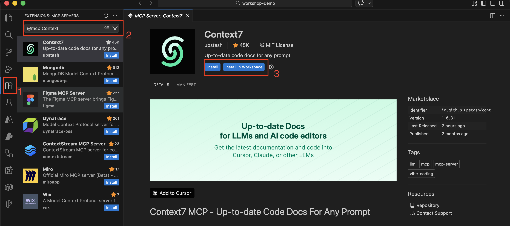

# Lab 0: Pre-Lab Setup - MCP Server Configuration

> **⏱️ Duration:** 20-25 minutes | **🎯 Goal:** Configure 3 MCP servers

---

## 📖 What You'll Accomplish

This pre-lab setup ensures you're ready for **Labs 1-5** by configuring three essential MCP servers:

| Server | Purpose | Used In Labs |
|--------|---------|--------------|
| **Context7** | Up-to-date library documentation | Lab 1 |
| **Playwright** | Browser automation & testing | Lab 2 |
| **Atlassian** | Jira/Confluence integration | Lab 3-4 |

✅ **Complete this setup BEFORE Lab 1** to avoid interruptions during hands-on exercises.

---

## ✅ Prerequisites Checklist

Before starting, ensure you have:

- [ ] **GitHub Copilot subscription** (Individual, Business, or Enterprise)
- [ ] **VS Code 1.99+** OR **GitHub Copilot CLI** installed
- [ ] **Node.js 18+** installed — verify with: `node --version`
- [ ] **Stable internet connection** (not blocked by corporate firewall)
- [ ] **Personal email address** (for Atlassian sandbox account)

---

## 🔧 Step 1: Choose Your Configuration Method

**⏱️ Time:** 2 minutes

You have **3 options** for configuring MCP servers. Choose the one that fits your workflow:


### 🎯 Option A: VS Code Workspace Configuration (RECOMMENDED)

```
📁 Location: .vscode/mcp.json (in your project folder)
```

**✅ Best for:**
- Working on a specific project
- Sharing configuration with your team (committed to git)

**✨ Advantages:**
- Team-shareable configuration
- Clean separation from personal settings
- Per-project customization

---

### 👤 Option B: VS Code User Configuration

```
📁 Location: User settings directory (varies by OS)
```

**Full paths:**
- **Windows:** `%APPDATA%\Code\User\mcp.json`
- **macOS:** `$HOME/Library/Application Support/Code/User/mcp.json`
- **Linux:** `$HOME/.config/Code/User/mcp.json`

**✅ Best for:**
- Personal setup across all projects
- Configuration you don't want to share with team

**✨ Advantages:**
- One-time configuration
- Available in all VS Code projects
- Not committed to version control

---

### 💻 Option C: GitHub Copilot CLI

```
📁 Location: ~/.copilot/mcp-config.json
```

**✅ Best for:**
- Terminal-based workflow
- Using Copilot outside VS Code
- Direct command-line access

**✨ Advantages:**
- Works anywhere (not tied to VS Code)
- Great for terminal-native developers
- Independent configuration


> 💡 **Note:** 
Requires CLI installation, see [GitHub Copilot CLI Installation](#-github-copilot-cli-installation) section below for setup instructions.


---

> 💡 **Recommendation:** Start with **Option A (Workspace)** for this workshop.

---

## 📚 Step 2: Context7 MCP Setup

**⏱️ Time:** 5 minutes | **🔑 Requires:** API Key

Context7 provides up-to-date documentation for popular libraries and frameworks.

---

### 2.1: Get Your Context7 API Key

**⏱️ Time:** 2 minutes

1. **Navigate to Context7:**
   - 🌐 Open: [https://context7.com/dashboard](https://context7.com/dashboard)

2. **Create Free Account:**
   
   Choose your signup method:
   - **Fastest:** Click **"Continue with Google"** (Google SSO)
   - **Alternative:** Enter email + password
   
   > 💳 **No credit card required!**

3. **Generate API Key:**
   - After login, you'll see the dashboard
   - Click **"Create API Key"** button
   - 📋 **Copy the generated key** (format: `ctx7sk-xxxxxxxxxxxxxxxxxxxxx`)
   
   > ⚠️ **IMPORTANT:** Save this key securely — you'll need it in the next step!

---

### 2.2: Configure Context7 MCP

**⏱️ Time:** 3 minutes


**Choose your configuration method:**

<details>
<summary><strong>📦 Option A & B: VS Code Configuration</strong> (click to expand)</summary>

<br>



**Step-by-step:**

1. **Open Extensions Panel**
   - Click the **Extensions** icon on the left sidebar
   
2. **Find Context7**
   - Type `@mcp Context7` in the search box
   - Select **Context7** from the results

3. **Install Context7**
   
   Choose your installation scope:
   - **Option A (Workspace):** Click **"Install in Workspace"**
     - Creates `.vscode/mcp.json` in your project folder
   - **Option B (User):** Click **"Install"**
     - Installs to `~/Code/User/mcp.json`

4. **Enter API Key**
   - Paste your Context7 API key when prompted
   - Format: `ctx7sk-xxxxxxxxxxxxxxxxxxxxx`

5. **Verify Installation**
   - Press `Cmd+Shift+P` (Mac) or `Ctrl+Shift+P` (Windows/Linux)
   - Type: `MCP: List Servers`
   - ✅ Confirm **context7** appears in the list

</details>

<details>
<summary><strong>💻 Option C: GitHub Copilot CLI</strong> (click to expand)</summary>

<br>

> 📝 **First-time CLI users?** See [GitHub Copilot CLI Installation](#-github-copilot-cli-installation) first

#### Method 1: Interactive Setup (Recommended)

```bash
# Start Copilot CLI
copilot

# Add MCP server interactively
/mcp add
```

**Follow the prompts:**
1. **Server name:** `context7`
2. **Command:** `npx`
3. **Args:** `-y @upstash/context7-mcp@latest`
4. **Environment variables:** `CONTEXT7_API_KEY=ctx7sk-xxxxxxxxxxxxx`
5. Navigate with `Tab`, save with `Ctrl+S`

**Verify:**
```bash
/mcp show
```

---

#### Method 2: Manual Configuration

Edit `~/.copilot/mcp-config.json`:

```json
{
  "mcpServers": {
    "context7": {
      "command": "npx",
      "args": ["-y", "@upstash/context7-mcp@latest"],
      "env": {
        "CONTEXT7_API_KEY": "ctx7sk-xxxxxxxxxxxxx"
      }
    }
  }
}
```

Save the file and restart Copilot CLI.

</details>

---

### 2.3: Verify Context7 Installation

**⏱️ Time:** 1 minute

**Test with this command:**

```
Use context7 to get React useState documentation
```

**✅ Expected Response:**
- Context7 returns React documentation
- You see a URL reference (react.dev)
- Syntax and examples look current

**✅ Success Checkpoint:** Context7 working? → Continue to Step 3

---

## 🎭 Step 3: Playwright MCP Setup

**⏱️ Time:** 5 minutes | **🔑 Requires:** No API key needed

Playwright enables browser automation and web testing directly from Copilot.

---

### 3.1: Configure Playwright MCP

**⏱️ Time:** 2 minutes

<details>
<summary><strong>📦 Option A & B: VS Code Configuration</strong> (click to expand)</summary>

<br>

**Step-by-step:**

1. **Open Extensions Panel** (As shown in Step 2: Context7 MCP Setup)
   - Click the **Extensions** icon on the left sidebar

2. **Find Playwright**
   - Type `@mcp Playwright` in the search box
   - Select **Playwright** from the results

3. **Install Playwright**
   
   Choose your installation scope:
   - **Option A (Workspace):** Click **"Install in Workspace"**
   - **Option B (User):** Click **"Install"**

4. **Verify Installation**
   - Press `Cmd+Shift+P` (Mac) or `Ctrl+Shift+P` (Windows/Linux)
   - Type: `MCP: List Servers`
   - ✅ Confirm **Playwright** appears in the list

</details>

<details>
<summary><strong>💻 Option C: GitHub Copilot CLI</strong> (click to expand)</summary>

<br>

#### Interactive Setup

```bash
# Inside Copilot CLI session
/mcp add
```

**Follow the prompts:**
1. **Server name:** `playwright`
2. **Command:** `npx`
3. **Args:** `-y @playwright/mcp@latest`
4. Navigate with `Tab`, save with `Ctrl+S`

**Verify:**
```bash
/mcp show
```

---

#### Manual Configuration

Edit `~/.copilot/mcp-config.json`:

```json
{
  "mcpServers": {
    "context7": { ... },
    "playwright": {
      "command": "npx",
      "args": ["-y", "@playwright/mcp@latest"]
    }
  }
}
```

</details>

---

### 3.2: Verify Playwright Installation

**⏱️ Time:** 1 minute

**Test with this command:**

```
Use playwright to navigate to https://example.com and take a screenshot
```

**✅ Expected Response:**
- Browser window opens (may be visible or headless)
- Screenshot is captured
- File path to screenshot is displayed
- Browser closes automatically

**✅ Success Checkpoint:** Playwright working? → Continue to Step 4

---

## 🔗 Step 4: Atlassian MCP Setup

**⏱️ Time:** 10 minutes | **🔑 Requires:** OAuth authentication

> ⚠️ **CRITICAL:** This step includes OAuth authentication setup. Complete it now to avoid interruptions during labs!

---

### 4.1: Create Atlassian Sandbox Account

**⏱️ Time:** 5 minutes

**Why use a sandbox account?**
- ✅ Full admin permissions for testing
- ✅ Safe environment (won't affect company data)
- ✅ Free tier sufficient for all labs
- ✅ No risk of breaking production systems

---

**Create your sandbox:**

**Step 1: Navigate to Atlassian Signup**
- 🌐 Open: [https://www.atlassian.com/try/cloud/signup](https://www.atlassian.com/try/cloud/signup)

**Step 2: Sign Up**
- Use your **personal email** (not your company email)
- Create a secure password
- Check your inbox and verify your email

**Step 3: Create Your Site**
- When prompted: **"What's your site name?"**
- Enter: `yourname-workshop` (e.g., `john-workshop`)
- Your site URL: `yourname-workshop.atlassian.net`
- 📋 **Write down this URL** — you'll need it later!

**Step 4: Select Products**
- ☑️ Select: **Jira Software**
- ☑️ Select: **Confluence**
- Click **"Continue"**

**Step 5: Skip Team Setup**
- Click **"Skip"** or **"I'll do this later"** when asked to invite team members
- You should now see your Jira dashboard

---

### 4.2: Create Test Project in Jira

**⏱️ Time:** 2 minutes

1. **Create New Project**
   - In Jira dashboard, click **"Create project"** button
   - Choose template: **Scrum** or **Kanban** (either works)
   
2. **Configure Project**
   - **Project name:** `MCP Workshop`
   - **Project key:** `MCPW` (or customize)
   - Click **"Create"**

3. **✅ Verify**
   - You should see an empty project board
   - URL format: `https://yourname-workshop.atlassian.net/jira/software/projects/MCPW`

---

### 4.3: Configure Atlassian MCP

**⏱️ Time:** 2 minutes


<details>
<summary><strong>📦 Option A & B: VS Code Configuration</strong> (click to expand)</summary>

<br>

**Step-by-step:**

1. **Open Extensions Panel** (As shown in Step 2: Context7 MCP Setup)
   - Click the **Extensions** icon on the left sidebar

2. **Find Atlassian**
   - Type `@mcp Atlassian` in the search box
   - Select **Atlassian** from the results

3. **Install Atlassian**
   
   Choose your installation scope:
   - **Option A (Workspace):** Click **"Install in Workspace"**
   - **Option B (User):** Click **"Install"**

4. **Verify Installation**
   - Press `Cmd+Shift+P` (Mac) or `Ctrl+Shift+P` (Windows/Linux)
   - Type: `MCP: List Servers`
   - ✅ Confirm **Atlassian** appears in the list

</details>

<details>
<summary><strong>💻 Option C: GitHub Copilot CLI</strong> (click to expand)</summary>

<br>

#### Interactive Setup

```bash
/mcp add
```

**Follow the prompts:**
1. **Server name:** `atlassian`
2. **Command:** `npx`
3. **Args:** `-y mcp-remote https://mcp.atlassian.com/v1/sse`
4. Navigate with `Tab`, save with `Ctrl+S`

**Verify:**
```bash
/mcp show
```

---

#### Manual Configuration

Edit `~/.copilot/mcp-config.json`:

```json
{
  "mcpServers": {
    "context7": { ... },
    "playwright": { ... },
    "atlassian": {
      "command": "npx",
      "args": ["-y", "mcp-remote", "https://mcp.atlassian.com/v1/sse"]
    }
  }
}
```

</details>

---

### 4.4: Complete OAuth Authentication

**⏱️ Time:** 1 minute

> ⚠️ **DO THIS NOW!** Complete the OAuth flow to prevent interruptions during labs.

**Test command to trigger OAuth:**

```
List my Jira projects using atlassian
```

---

**🔐 OAuth Flow (automatic):**

| Step | What Happens | What To Do |
|------|--------------|------------|
| **1. Browser Opens** | New browser window/tab opens automatically | Wait for Atlassian login page |
| **2. Sign In** | Atlassian login page appears | Enter your sandbox account credentials |
| **3. Grant Access** | Permission request screen | Click **"Accept"** or **"Allow"** |
| **4. Success** | "Success! You can close this window" message | Return to VS Code or terminal |

**✅ Expected Result:**
- List of your Jira projects appears
- You should see `MCPW` (or your project key) in the list

---

> 💡 **Troubleshooting OAuth:** If the browser doesn't open automatically, check for popup blockers or copy the OAuth URL manually.

**✅ Success Checkpoint:** OAuth complete and projects listed? → Continue to Step 5

---

## ✅ Step 5: Final Verification

**⏱️ Time:** 2 minutes

Test all three MCP servers together to ensure everything is working.

---

### Test All Servers

```
Use context7 to get React documentation

Use playwright to navigate to example.com

List my Jira projects
```

> 💡 **Tip:** Copy all three commands at once and wait for responses.

---

### Expected Results

| Server | ✅ Success Indicators |
|--------|----------------------|
| **Context7** | Returns React documentation with react.dev reference |
| **Playwright** | Browser opens, navigates to site, closes automatically |
| **Atlassian** | Lists your projects including `MCPW` |

<br>

> ⚠️ If any test fails, see the [🔧 Troubleshooting](#-troubleshooting) section below.

---

## 🎉 Setup Complete!

### ✅ Pre-Lab Completion Checklist

Before proceeding to Lab 1, verify you've completed:

### Configuration
- [ ] **Context7 configured** and responds to test query
- [ ] **Playwright configured** and browser launches successfully  
- [ ] **Atlassian configured** and OAuth authentication completed

### Verification
- [ ] **All 3 servers verified** with test commands from [Step 5](#-step-5-final-verification)
- [ ] **Jira project created** (Project key: `MCPW` or your custom key)
- [ ] **No OAuth popups** when testing Atlassian (already authenticated)

### System Check
- [ ] **Node.js 18+** installed and verified
- [ ] **VS Code 1.99+** or Copilot CLI working
- [ ] **Internet connection** stable

---

## 🎯 Next Steps

**✨ You're ready for hands-on labs.**

### Continue Your Learning Journey:

1. **Start Lab 1:** [Context7 MCP - Working with Documentation](lab-01-context7.md)
2. **Keep this guide handy:** Reference for troubleshooting during labs
3. **Share with your team (Optional):** If using workspace configuration (`.vscode/mcp.json`)

---

## 💻 GitHub Copilot CLI Installation

> 📝 **Note:** This section is for **CLI users only**. If you're using VS Code (Options A or B), skip this section.

---

### Prerequisites

Before installing the CLI:

- ✅ Active GitHub Copilot subscription
- ✅ Node.js and npm installed

---

### Install GitHub Copilot CLI

```bash
npm install -g @github/copilot
```

**Learn more:** [https://cli.github.com/](https://cli.github.com/)

**Launch the CLI:**

```bash
copilot          # or: gh copilot
```

---

### Copilot CLI MCP Configuration

**Configuration file location:** `~/.copilot/mcp-config.json`

> 💡 **Built-in MCP:** The CLI comes with GitHub MCP server pre-configured for GitHub.com resources (PRs, issues, repos).

---

## 🔧 Troubleshooting

Having issues? Find your problem below for quick solutions.

---

### 🚫 Issue: MCP Server Not Responding

**Symptom:** `Context7` or other MCP server shows no response

**Solutions:**

1. **Check MCP server status:**
   - VS Code: `Cmd+Shift+P` → `MCP: List Servers` → Verify MCP server is running
   - CLI: `copilot` → `/mcp show` → Verify MCP server listed

2. **Reload VS Code Window**
   - Press `Cmd+Shift+P` (Mac) or `Ctrl+Shift+P` (Windows/Linux)
   - Type: `Developer: Reload Window`
   - Press Enter

3. **Validate JSON Configuration**
   - Check for missing commas, quotes, or brackets
   - Use online validator: [https://jsonlint.com/](https://jsonlint.com/)
   - Common mistakes:
     - Missing comma between server entries
     - Incorrect quote types (use `"` not `'`)

4. **Verify Node.js Version**
   ```bash
   node --version  # Should be 18 or higher
   ```
   
   If outdated, download latest from: [https://nodejs.org/](https://nodejs.org/)

5. **Restart Terminal (CLI users)**
   - Close and reopen your terminal
   - Restart Copilot CLI

---

### 🔑 Issue: Context7 Authentication Failed

**Symptom:** "Invalid API key" or "Authentication failed"

**Solutions:**

1. **Check API Key Format**
   - Should start with `ctx7sk-`
   - No extra spaces or line breaks
   - Example: `ctx7sk-1a2b3c4d5e6f7g8h9i0j`

2. **Regenerate API Key**
   - Go to [https://context7.com/dashboard](https://context7.com/dashboard)
   - Click **"Create API Key"** (creates a new key)
   - Copy the new key
   - Update your MCP configuration
   - Reload VS Code window

3. **Verify Configuration Location**
   - Workspace: Check `.vscode/mcp.json` exists
   - User: Check file path matches your OS (see [Step 1](#-step-1-choose-your-configuration-method))

---

### 🎭 Issue: Browser Won't Launch (Playwright)

**Symptom:** "browserType.launch: Executable doesn't exist"

**Solutions:**

1. **Install Chromium**
   ```bash
   npx playwright install chromium
   ```
   
   Wait for download to complete (~100MB)

2. **Allow Browser Execution (macOS)**
   - Go to **System Preferences** → **Security & Privacy**
   - Click **"Allow"** when Chromium is blocked
   - Try test command again

3. **Check Permissions (Linux)**
   ```bash
   chmod +x ~/.cache/ms-playwright/*/chromium*/chrome
   ```

4. **Install System Dependencies (Linux)**
   ```bash
   npx playwright install-deps chromium
   ```

---

### 🔐 Issue: OAuth Flow Fails (Atlassian)

**Symptom:** Browser opens but authentication doesn't complete

**Solutions:**

1. **Check Browser Popup Blocker**
   - Allow popups from VS Code or terminal
   - Browser settings → Site permissions
   - Add exception for OAuth redirect

2. **Try Different Browser**
   - Copy the OAuth URL from terminal/VS Code
   - Paste into different browser (Chrome, Firefox, Safari)
   - Complete authentication there
   - Return to VS Code

3. **Disable VPN/Corporate Proxy**
   - Corporate VPN may block OAuth redirects
   - Try on personal network or mobile hotspot
   - Re-enable after authentication completes

4. **Manual OAuth URL**
   - If browser doesn't auto-open, look for URL in terminal output
   - Copy and paste into browser manually
   - Format: `https://auth.atlassian.com/...`

---

### ⚙️ Issue: MCP Servers Not Showing in VS Code

**Symptom:** Configuration looks correct but servers don't appear in `MCP: List Servers`

**Solutions:**

1. **Verify VS Code Version**
   - Go to **Help** → **About**
   - Should be version **1.99 or higher**
   - Update if needed: [https://code.visualstudio.com/](https://code.visualstudio.com/)

2. **Check Configuration File Location**
   
   **Workspace configuration (Option A):**
   ```
   /your-project/.vscode/mcp.json
   ```
   Must be in the **root** of workspace folder
   
   **User configuration (Option B):**
   - Windows: `%APPDATA%\Code\User\mcp.json`
   - macOS: `~/Library/Application Support/Code/User/mcp.json`
   - Linux: `~/.config/Code/User/mcp.json`

3. **Verify GitHub Copilot Extension**
   - Go to **Extensions** panel
   - Search: `GitHub Copilot`
   - Ensure installed and enabled
   - Check subscription: Click Copilot icon in bottom-right
   - Sign in if needed

4. **Check Extension Logs**
   - Press `Cmd+Shift+P` → `Developer: Show Logs`
   - Select **"GitHub Copilot"** or **"Extension Host"**
   - Look for MCP-related errors

---

### 🌐 Issue: Network/Firewall Blocking

**Symptom:** Timeouts or "Connection refused" errors

**Solutions:**

1. **Check Internet Connection**
   ```bash
   ping context7.com
   ping atlassian.com
   ```

2. **Corporate Firewall**
   - Contact IT to whitelist:
     - `context7.com`
     - `atlassian.com`
     - `mcp.atlassian.com`
     - `registry.npmjs.org` (for npx commands)

---

## 📋 Quick Reference

### Test Commands (Copy-Paste Ready)

```bash
# Test Context7
Use context7 to get React documentation

# Test Playwright
Use playwright to navigate to https://example.com

# Test Atlassian
List my Jira projects
```

---
