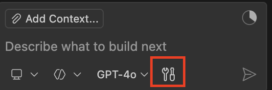
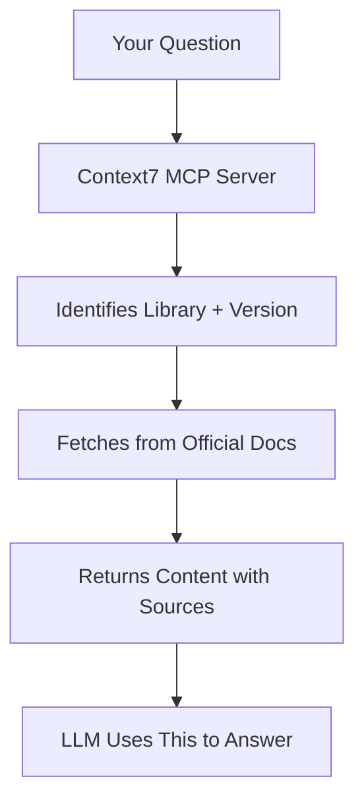

# Lab 1: Context7 - Up-to-Date Library Documentation

| | |
|---|---|
| **Duration** | 15 minutes |
| **Prerequisites** | Lab 0 complete (Context7 MCP configured) |
| **Difficulty** | ⭐ Low |

## 🎯 Lab Goal

Learn how Context7 fetches **current, version-specific** library documentation to solve the "outdated training data" problem.

---

## 📚 What You'll Learn

By the end of this lab, you will:

- ✅ Understand why LLM training data becomes outdated
- ✅ Know how Context7 fetches live docs from official sources
- ✅ Compare AI responses with and without Context7
- ✅ Retrieve version-specific documentation on demand
- ✅ Recognize when to use Context7 vs base model knowledge

---

## 🗺️ Lab Overview

### What You'll Do
1. ❌ Query Copilot **without** Context7 (see the problem)
2. ✅ Query **with** Context7 (see the solution)
3. 🔍 Compare responses and identify key differences
4. 🧪 Test multiple libraries (React, Next.js, Vue)
5. ✔️ Verify source attribution and version accuracy

### Key Concept
Context7 eliminates the **"works in docs but not in code"** problem by fetching live documentation instead of relying on potentially outdated training data.

---

## ✅ Prerequisites Check

Before starting, verify you have:

- [ ] Context7 MCP server configured (from Lab 0)
- [ ] Context7 API key active
- [ ] Test query works: `Use context7 fetch React documentation for useState`

> **⚠️ If any fail:** See [Lab 0 - Step 2](lab-00-pre-lab-setup.md#step-2-context7-mcp-setup-5-minutes) or [Troubleshooting](#troubleshooting) below

---

## Step 1: The Problem - Outdated Training Data

⏱️ **5 minutes**

### 1.1 Disable Context7

**Purpose:** See what the base model knows without live documentation

**VS Code:**
<br>


1. Click **Configure Tools** in the Chat Window
2. Find **Context7** and **uncheck** it
3. Click **OK**

**CLI:**
1. Run `/mcp show` and find the Context7 MCP name
2. Run `/mcp disable context7_mcp_name`

---

### 1.2 Query Without Context7

**Copy and paste this exact prompt:**

```
What's the syntax for React 19's use hook? Give me a code example.
```

> **💡 Note:** We're intentionally NOT using Context7 to demonstrate the problem

---

### 1.3 Observe the Response

Copilot may respond with:

| Response Type | Meaning |
|---------------|---------|
| ✅ Correct syntax | React 19 was in training data |
| ⚠️ Outdated syntax | Using React 17/18 documentation |
| ❌ Hallucinated API | Mixing patterns from different versions |
| 🤷 "I don't know" | Honest but not helpful |

**The response varies** - and that's exactly the problem!

---

### 1.4 Analyze the Response

Ask yourself these questions:

| Question | Likely Answer |
|----------|---------------|
| Is there a **source URL**? | ❌ No |
| Is the **version** confirmed? | ❌ No |
| Can I **verify** this information? | ❌ No |

**This uncertainty is the problem Context7 solves.**

---

### 📝 Action: Document Your Findings

Take quick notes on:
- What did Copilot say about the `use` hook?
- Did it mention React 19 specifically?
- Was a source provided?

You'll compare this with Step 2.

---

## Step 2: The Solution - Context7 Live Documentation

⏱️ **5 minutes**

### 2.1 Enable Context7

**VS Code:**
1. Click **Configure Tools** in the Chat Window
2. Find **Context7** and **check** it
3. Click **OK**

**CLI:**
1. Run `/mcp show` and find the Context7 MCP name
2. Run `/mcp enable context7_mcp_name`

---

### 2.2 Query WITH Context7

**Copy and paste this exact prompt:**

```
Use context7 to fetch React 19 documentation for the use hook
```

> **💡 Note:** MCP tools are model-controlled - the AI will automatically discover and invoke the right tools based on your prompt.

---

### 2.3 Example Response

You should see something like:

```
[Context7] Resolving library: react
[Context7] Version: 19.0.0
[Context7] Fetching from: https://react.dev/reference/react/use

The `use` Hook is a React Hook that lets you read the value of a 
resource like a Promise or context.

Syntax:
  const value = use(resource)

Parameters:
  - resource: The source of the data you want to read. A resource 
    can be a Promise or a context.

Returns:
  - Returns the value that was resolved from the resource...

[Source: https://react.dev/reference/react/use]
```

---

### 2.4 What's Happening Behind the Scenes?

**MCP Tools Invoked:**

1. **`resolve-library-id`** - Identifies "react" as a known library
2. **`get-library-docs`** - Retrieves up-to-date documentation
3. **Response Assembly** - Returns docs with source attribution

**Key Difference:** Context7 pulls **live, version-specific** documentation from **official sources**, not training data!

---

### 2.5 Verify the Response

Check for these three critical elements:

| Element | What to Look For | Expected |
|---------|------------------|----------|
| ✅ **Source URL** | Where docs came from | `react.dev` (official) |
| ✅ **Version** | Specific version number | `19.0.0` |
| ✅ **Current Syntax** | Actual documented API | Matches official docs |

**The Value of Context7:**
- 🎯 No hallucination risk
- 📌 Version-specific information
- ✔️ Verifiable sources

---

## Step 3: Compare the Difference

⏱️ **2 minutes**

### Side-by-Side Comparison

| Aspect | ❌ Without Context7 | ✅ With Context7 |
|--------|---------------------|------------------|
| **Source** | No citation | `reactjs/react.dev` |
| **Version** | Not confirmed | `19.0.0` explicitly stated |
| **Accuracy** | Unknown (could be hallucinated) | Fetched from official docs |
| **Trust Level** | Uncertain ⚠️ | High ✔️ (verifiable) |

### 💡 Key Takeaway

> **Context7 eliminates the "works in docs but not in code" problem by fetching live documentation instead of relying on potentially outdated training data.**

---

## Step 4: Try More Libraries

⏱️ **3 minutes**

### Test Case 1: Next.js

**Prompt:**
```
Use context7 to fetch Next.js 15 app router documentation for server actions
```

**Expected:** ✅ Current Next.js 15 docs with source URL

---

### Test Case 2: Vue

**Prompt:**
```
Use context7 to fetch Vue 3 Composition API documentation for ref
```

**Expected:** ✅ Vue 3 docs from official source

---

### Test Case 3: Your Stack

Choose a library relevant to your work:

**Prompt Template:**
```
Use context7 fetch [LIBRARY] [VERSION] documentation for [FEATURE]
```

**Examples:**

| Library | Prompt |
|---------|--------|
| **Tailwind CSS** | `Use context7 fetch Tailwind CSS v4 documentation for container queries` |
| **TypeScript** | `Use context7 fetch TypeScript 5.3 documentation for satisfies operator` |
| **Python** | `Use context7 fetch Python 3.12 documentation for match statement` |

**Verify Each Response:**
- ✅ Source URL shown
- ✅ Version correct
- ✅ Documentation current

---

## Step 5: Understanding the Pattern

⏱️ **2 minutes**

### When to Use Context7

| Scenario | Use Context7? |
|----------|---------------|
| Fast-moving libraries (React, Next.js, Vue) | ✅ Yes |
| Version-specific documentation needed | ✅ Yes |
| Want to verify syntax against official docs | ✅ Yes |
| Unsure if AI knowledge is current | ✅ Yes |
| Stable, unchanging APIs (basic JavaScript) | ❌ No |
| General programming concepts | ❌ No |
| Questions about your own codebase | ❌ No |

---

### How Context7 Works

**Simple mental model:**



**NOT using training data** - fetching **live documentation**

---

## 🎉 Lab 1 Complete!

### 📋 Concepts Review

1. **Training Data Cutoff**
   - LLMs are trained on data up to a specific date
   - New library versions after cutoff aren't in training data
   - Can lead to outdated or incorrect syntax

2. **Context7's Approach**
   - Fetches live documentation from official sources
   - Provides version-specific retrieval
   - Includes source attribution for verifiability

3. **When to Use**
   - Fast-moving libraries with frequent updates
   - Version-specific questions
   - Syntax verification before implementation

4. **MCP Pattern**
   - Context7 uses MCP tools (`resolve-library-id`, `get-library-docs`)
   - Returns structured data for AI response generation

---

### ✅ Success Checklist

**Before moving to Lab 2, confirm:**

- [ ] Queried **without** Context7 (Step 1)
- [ ] Queried **with** Context7 (Step 2)
- [ ] Compared the two responses (Step 3)
- [ ] Tried at least 2 libraries (Step 4)
- [ ] Understand when to use Context7 (Step 5)
- [ ] Saw source URLs in Context7 responses
- [ ] Confirmed version-specific docs were fetched

**All checked?** → ✅ **Lab 1 Complete!** Proceed to [Lab 2](lab-02-playwright.md)

💡 **Tip:** Take a 2-minute break before continuing!

---

## 🔧 Troubleshooting

### Issue 1: Context7 Not Responding

**Symptom:** `Use context7` command shows no response

**Solutions:**

1. **Check MCP server status**
   - **VS Code:** `Cmd+Shift+P` → `MCP: List Servers` → Verify context7 is running
   - **CLI:** `copilot` → `/mcp show` → Verify context7 listed

2. **Reload the environment**
   - **VS Code:** `Cmd+Shift+P` → `Developer: Reload Window`
   - **CLI:** Exit and restart `copilot`

3. **Verify API key**
   - Depending on your configuration: check `.vscode/mcp.json` or `~/Code/User/mcp.json` or `~/.copilot/mcp-config.json`
   - Ensure `CONTEXT7_API_KEY` is set correctly
   - No extra spaces, correct format

---

### Issue 2: "Invalid API Key" Error

**Symptom:** "Authentication failed" or "Invalid Context7 API key"

**Solutions:**

1. **Check API key format**
   - Should start with `ctx7sk-`
   - No extra spaces or quotes

2. **Regenerate API key**
   ```
   1. Go to https://context7.com/dashboard
   2. Log in
   3. Click "Create API Key"
   4. Copy new key
   5. Update configuration
   6. Reload VS Code or restart CLI
   ```

---

### Issue 3: "Library Not Found"

**Symptom:**
```
Context7: Could not resolve library "some-obscure-lib"
```

**Solutions:**

- Use a well-known library: `react`, `next`, `vue`, `tailwind`, `typescript`
- Check [supported libraries](https://github.com/upstash/context7#supported-libraries)
- Try alternative query with broader library name

---

### Issue 4: Slow Response (>10 seconds)

**Symptom:** Context7 taking very long to respond

**Causes & Solutions:**

| Cause | Solution |
|-------|----------|
| First fetch for library | Wait up to 20 seconds (downloading docs) |
| Network latency | Check internet connection |
| API rate limiting | Wait a moment and retry |
| Timeout (>30 seconds) | Cancel and retry |

**Quick test:** Try a different library to verify Context7 is working

---

### Issue 5: Response is Outdated

**Symptom:** Context7 returns docs for old version (e.g., asking for React 19, getting React 17)

**Solutions:**

1. **Make version explicit:**
   ```
   Use context7 fetch React version 19 use hook documentation
   ```

2. **Try alternative formats:**
   - `React latest`
   - `React 19.0.0`

3. **If still outdated:**
   - Context7 may be updating its index
   - Verify on official docs site manually

---

## 📚 Reference Materials

### Quick Copy Prompts

**All exact prompts used in this lab:**

```bash
# Step 1: Without Context7
What's the syntax for React 19's use hook? Give me a code example.

# Step 2: With Context7
Use context7 to fetch React 19 documentation for the use hook

# Step 4: Additional Examples
Use context7 to fetch Next.js 15 app router documentation for server actions
Use context7 to fetch Vue 3 Composition API documentation for ref
Use context7 to fetch Tailwind CSS v4 documentation for container queries
```

---

### Supported Libraries

**Well-indexed libraries (fast response):**

| Library | Identifier | Example Use Case |
|---------|-----------|------------------|
| React | `react` | React hooks, components |
| Next.js | `next` | App router, server actions |
| Vue.js | `vue` | Composition API, reactivity |
| Tailwind CSS | `tailwind` | Utility classes, configuration |
| TypeScript | `typescript` | Type system, operators |
| Python | `python` | Built-in functions, syntax |
| Node.js | `node` | APIs, modules |
| Express | `express` | Middleware, routing |

**View full list:** [Context7 Supported Libraries](https://github.com/upstash/context7#supported-libraries)

---

### Additional Resources

**Context7:**
- 🌐 Official Site: https://context7.com
- 📦 GitHub: https://github.com/upstash/context7
- 📋 Supported Libraries: https://github.com/upstash/context7#supported-libraries

**Related Technologies:**
- 🔌 MCP Protocol: https://modelcontextprotocol.io
- ☁️ Upstash: https://upstash.com

---

**Next Lab:** [Lab 2: Playwright - Browser Automation](lab-02-playwright.md)
