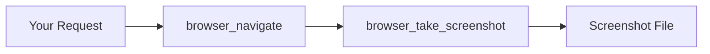
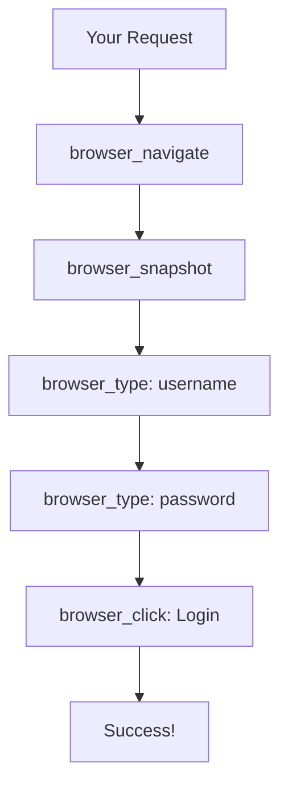

# Lab 2: Playwright - AI-Driven Browser Automation

| | |
|---|---|
| **Duration** | 15 minutes |
| **Prerequisites** | Lab 0 complete (Playwright MCP configured + browser installed) |
| **Difficulty** | ⭐⭐ Low-Medium |

## 🎯 Lab Goal

Learn to **automate browser actions through natural language** using Playwright MCP—no code required!

---

## 📚 What You'll Learn

By the end of this lab, you will:

- ✅ Automate browser navigation without writing code
- ✅ Capture screenshots programmatically via AI commands
- ✅ Fill forms and interact with web pages naturally
- ✅ Understand Playwright MCP vs Playwright library trade-offs
- ✅ Recognize practical use cases (testing, UX review, documentation)

---

## 🗺️ Lab Overview

### What You'll Do
1. 🌐 Navigate to a website and capture a screenshot
2. 📝 Fill out a login form automatically
3. 🖱️ Interact with page elements (click, type, submit)
4. 🔍 Understand when to use Playwright MCP vs library

### Key Concept
Playwright MCP translates **natural language** into **browser automation**, eliminating the need to write selectors or code manually.

---

## ✅ Prerequisites Check

Before starting, verify you have:

- [ ] Playwright MCP server configured (from Lab 0)
- [ ] Browser installed (Chromium, Firefox, or WebKit)
- [ ] Test query works: `Use playwright to navigate to https://example.com`

> **⚠️ If any fail:** See [Lab 0 - Step 3](lab-00-pre-lab-setup.md#-step-3-playwright-mcp-setup) or [Troubleshooting](#-troubleshooting) below

---

## Step 1: Navigate and Screenshot

⏱️ **5 minutes**

### 1.1 Basic Navigation

**Copy and paste this exact prompt:**

```
Use playwright to navigate to https://example.com and take a screenshot
```

---

### 1.2 What to Expect

**Behind the scenes:**

| Step | What Happens |
|------|-------------|
| 1️⃣ **Browser Launch** | Opens browser (visible or headless) |
| 2️⃣ **Navigation** | Loads https://example.com |
| 3️⃣ **Screenshot** | Captures full-page screenshot |
| 4️⃣ **Save & Report** | Saves to disk and shows path |

**Example Response:**

```
Ran Navigate to URL - playwright (MCP Server)
Ran Take a screenshot - playwright (MCP Server)

✅ I have successfully navigated to https://example.com and taken 
a full-page screenshot. The screenshot has been saved as 
example-com-screenshot.png.
```

---

### 1.3 View the Screenshot

**Locate and open your screenshot:**

| OS | Command |
|----|----------|
| **macOS/Linux** | `open ~/*-screenshot.png` |
| **Windows** | `start ~/*-screenshot.png` |
| **Manual** | Navigate to the path shown in response |

---

### 1.4 What Just Happened?

**MCP Tools Invoked:**



1. **`browser_navigate`** - Opens browser and navigates to URL
2. **`browser_take_screenshot`** - Captures screenshot of current page

**Key Point:** You didn't write any Playwright code like:

```javascript
// Traditional Playwright code
await page.goto('https://example.com')
await page.screenshot({ path: 'screenshot.png' })
```

The AI translated your natural language into MCP tool calls!

---

## Step 2: Form Interaction

⏱️ **7 minutes**

### 2.1 Navigate to Login Form

We'll use a **safe test login page** for practice.

**Copy and paste this exact prompt:**

```
Use playwright to navigate to https://the-internet.herokuapp.com/login and fill in:
- Username: tomsmith
- Password: SuperSecretPassword!
Then click the Login button
```

---

### 2.2 What to Expect

**Automated workflow:**

| Step | Action | Details |
|------|--------|----------|
| 1️⃣ | **Navigate** | Opens login page |
| 2️⃣ | **Analyze** | AI reads page structure |
| 3️⃣ | **Identify** | Finds username/password fields |
| 4️⃣ | **Fill Username** | Types "tomsmith" |
| 5️⃣ | **Fill Password** | Types "SuperSecretPassword!" |
| 6️⃣ | **Click Login** | Submits form |
| 7️⃣ | **Verify** | Confirms success page |

**Example Response:**

```
Ran Navigate to URL - playwright (MCP Server)
Ran Type text - playwright (MCP Server)
Ran Type text - playwright (MCP Server)
Ran Click - playwright (MCP Server)

✅ The page navigated to the secure area, and the message 
"You logged into a secure area!" is displayed.

Web Page shows: "You logged into a secure area!"
```

---

### 2.3 What Just Happened?

**MCP Tools Invoked:**



1. **`browser_navigate`** - Navigate to URL
2. **`browser_snapshot`** - Get accessibility tree (identify form fields)
3. **`browser_type`** - Fill username field
4. **`browser_type`** - Fill password field
5. **`browser_click`** - Click Login button

**The AI Handled:**
- 🔍 No CSS selectors needed from you
- 🎯 Identified fields automatically via accessibility tree
- 🔄 Managed multi-step workflow
- ✅ Verified the result (success page)

---

### 2.4 Try a Variation

**Add screenshot at the end:**

```
Use playwright to navigate to https://the-internet.herokuapp.com/login and fill in:
- Username: tomsmith
- Password: SuperSecretPassword!
Then click Login and take a screenshot of the result page
```

**Expected:** ✅ Browser completes login + captures success page screenshot

---

## Step 3: Review Practical Use Cases

⏱️ **2 minutes**

| Use Case | Example Prompt | Benefit |
|----------|----------------|----------|
| **🧪 E2E Testing** | `Test the user registration flow: navigate, fill form, verify success` | Automated smoke tests without code |
| **🎨 UX Review** | `Try all forms on example.com and report confusing elements` | AI explores site, identifies friction |
| **📸 Documentation** | `Capture each step of checkout: cart → shipping → payment` | Auto-generated step-by-step guides |
| **🔄 Regression Testing** | `Verify login form still works after deployment` | Quick post-deployment verification |

---

### Example Prompts

**1. E2E Testing**
```
Use playwright, test the user registration flow:
1. Navigate to https://example.com/register
2. Fill in email, password, confirm password
3. Check "I agree to terms"
4. Click Register
5. Verify success message appears
```

**2. UX Review**
```
Use playwright, explore https://example.com and report:
- Any broken forms
- Confusing navigation
- Missing error messages
```

**3. Screenshot Documentation**
```
Use playwright to capture each checkout step:
1. Add item to cart (screenshot)
2. View cart (screenshot)
3. Enter shipping info (screenshot)
4. Complete payment (screenshot)
```

**4. Regression Testing**
```
Use playwright to verify critical flows after deployment:
1. Login works
2. Search returns results  
3. Checkout completes
```

---

## Step 4: Playwright MCP vs Library

⏱️ **1 minute**

### When to Use Each

**✅ Playwright MCP:**
- 🚀 Ad-hoc testing (quick verification)
- 🔍 Exploring new sites (don't know selectors)
- 🧪 Prototyping automation workflows
- ⏩ One-off tasks (screenshots, form fills)
- 🗣️ Don't want to write code

**✅ Playwright Library:**
- 🛠️ Production test suites (repeatable, version-controlled)
- 🔄 CI/CD pipelines (explicit test code)
- 🎯 Complex workflows (fine-grained control)
- ⚡ Performance-critical scenarios
- 👥 Team collaboration on test code

---

## 🎉 Lab 2 Complete!

### 📋 Concepts Review

1. **Natural Language Automation**
   - Describe actions in plain English
   - AI translates to Playwright actions
   - No manual selectors or code needed

2. **MCP Tools**
   - Each Playwright action is an MCP tool
   - Tools invoked automatically by AI
   - Tool execution visible in responses

3. **Accessibility Tree**
   - Playwright uses page structure to find elements
   - No manual selector identification required
   - Works best with semantic HTML

4. **Use Cases**
   - Testing (E2E, smoke tests, regression)
   - UX review and feedback
   - Screenshot documentation
   - Form automation

---

### ✅ Success Checklist

**Before moving to Lab 3, confirm:**

- [ ] Navigated to website and captured screenshot (Step 1)
- [ ] Viewed the screenshot file (Step 1)
- [ ] Filled out login form automatically (Step 2)
- [ ] Saw success page after form submission (Step 2)
- [ ] Understand MCP vs Library trade-offs (Step 4)
- [ ] Recognize practical use cases (Step 3)

**All checked?** → ✅ **Lab 2 Complete!** Proceed to [Lab 3](lab-03-jira-sync.md)

💡 **Tip:** Take a 2-minute break before continuing!

---

## 🔧 Troubleshooting

### Issue 1: Browser Won't Launch

**Symptom:** `Error: browserType.launch: Executable doesn't exist`

**Solutions:**

1. **Install browser binaries**
   ```bash
   npx playwright install chromium
   ```

2. **macOS: Grant permissions**
   - System Preferences → Security & Privacy
   - Allow Chromium to run
   - If needed: `xattr -cr ~/.cache/ms-playwright/chromium-*/`

3. **Verify installation**
   ```bash
   npx playwright install --dry-run
   ```
   Expected: `✓ chromium is installed`

---

### Issue 2: Permission Denied

**Symptom:** `Error: spawn EACCES`

**Solutions:**

| OS | Command |
|----|----------|
| **macOS/Linux** | `chmod +x ~/.cache/ms-playwright/chromium-*/chrome-mac/Chromium.app/Contents/MacOS/Chromium` |
| **Windows** | Run PowerShell as Administrator, then `npx playwright install chromium` |

---

### Issue 3: Form Fields Not Found

**Symptom:** `Could not find element with selector 'username'`

**Causes:**
- Page structure changed
- JavaScript not loaded yet
- Accessibility tree unavailable

**Solutions:**

1. **Wait for page load**
   ```
   Use playwright to navigate to [URL] and wait for page to fully load, 
   then fill the form
   ```

2. **Use backup test site**
   - Alternative: https://practice.expandtesting.com/login
   - Credentials: `practice` / `SuperSecretPassword!`

3. **Break into steps**
   ```
   Use playwright to navigate to [URL]
   playwright take a screenshot to see the page
   playwright type "tomsmith" into the username field
   playwright type "SuperSecretPassword!" into the password field
   playwright click the Login button
   ```

---

### Issue 4: Screenshot Not Found

**Symptom:** Screenshot reported as saved but file not visible

**Solutions:**

1. **Check current directory**
   ```bash
   ls -la *.png
   pwd
   ```

2. **Search for recent screenshots**
   ```bash
   find ~ -name "*.png" -mtime -1
   ```

3. **Specify absolute path**
   ```
   Use playwright to navigate to https://example.com and save 
   screenshot to /Users/yourname/Desktop/test.png
   ```

---

### Issue 5: Test Site Down

**Symptom:** `ERR_CONNECTION_REFUSED` or timeout

**Cause:** the-internet.herokuapp.com occasionally down (Heroku free tier)

**Solutions:**

**Backup Site 1:**
```
Use playwright to navigate to https://practice.expandtesting.com/login 
and fill in:
- Username: practice
- Password: SuperSecretPassword!
Then click Login
```

**Backup Site 2 (simple stable site):**
```
Use playwright to navigate to https://example.com
```

---

## 📚 Reference Materials

### Quick Copy Prompts

**All exact prompts used in this lab:**

```bash
# Step 1: Navigate and Screenshot
Use playwright to navigate to https://example.com and take a screenshot

# Step 2: Form Interaction
Use playwright to navigate to https://the-internet.herokuapp.com/login and fill in:
- Username: tomsmith
- Password: SuperSecretPassword!
Then click the Login button

# Step 2.4: With Screenshot
Use playwright to navigate to https://the-internet.herokuapp.com/login and fill in:
- Username: tomsmith
- Password: SuperSecretPassword!
Then click Login and take a screenshot of the result page

# Backup Test Site
Use playwright to navigate to https://practice.expandtesting.com/login and fill in:
- Username: practice
- Password: SuperSecretPassword!
Then click the Login button
```

---

### Playwright MCP Tools Reference

**Common tools:**

| Tool | Purpose | Example Use |
|------|---------|-------------|
| `browser_navigate` | Navigate to URL | Opens specified URL |
| `browser_snapshot` | Get page structure | Returns accessibility tree |
| `browser_take_screenshot` | Capture screenshot | Saves PNG to disk |
| `browser_click` | Click element | Clicks button/link |
| `browser_type` | Type into field | Fills input fields |
| `browser_fill_form` | Fill multiple fields | Batch form filling |

---

### Test Sites for Practice

| Site | Purpose | Credentials |
|------|---------|-------------|
| **the-internet.herokuapp.com** | Primary test site | `tomsmith` / `SuperSecretPassword!` |
| **practice.expandtesting.com** | Backup test site | `practice` / `SuperSecretPassword!` |
| **example.com** | Simple stable site | N/A |

---

### Additional Resources

- 🌐 GitHub: https://github.com/microsoft/playwright-mcp
- 📖 Playwright Docs: https://playwright.dev
- 🔌 MCP Protocol: https://modelcontextprotocol.io

---

